# Script dependency diagram (src/)

Rectangles = scripts, rounded = data/output files, cylinders = external data/tools.
Derived from the read/write calls in each script; edges for 6b/6c/6h/6i inputs were inferred from file names.

```mermaid
flowchart TD
  classDef script fill:#dbeafe,stroke:#1d4ed8,color:#000
  classDef data fill:#fef9c3,stroke:#a16207,color:#000
  classDef ext fill:#e5e7eb,stroke:#374151,color:#000
  classDef fig fill:#dcfce7,stroke:#15803d,color:#000

  %% ---------- external inputs ----------
  RAW[(marine_particles_source_data<br/>ESV table .csv + RDP taxonomy)]:::ext
  FASTSPAR[(fastspar / SparCC)]:::ext
  FUNK[(functionInk<br/>~/functionInk)]:::ext
  META[(metabolism/<br/>genome_aligment + GEM xml)]:::ext
  DBCAN[(dbCAN outputs<br/>overview / CGC)]:::ext
  TARA[(Tara Oceans<br/>OM-RGC_v2 + Salazar metadata)]:::ext

  %% ---------- core pipeline ----------
  S1["1_filter_asv_table_and_build_sparcc_network"]:::script
  RAW --> S1
  FASTSPAR --> S1
  S1 --> D1(["otu_table_SUBSTRATE<br/>interactions_filtered_0.01._SUBSTRATE_.tsv"]):::data

  S2["2_select_correlation_threshold"]:::script
  D1 --> S2
  S2 --> D2(["minimun_correlations_threshold.tsv"]):::data
  S2 --> F2>"double_linear_model.png"]:::fig

  S3["3_filter_network_by_threshold"]:::script
  D1 --> S3
  D2 --> S3
  S3 --> D3(["interactions_filtered_p0.01_threshold_SUBSTRATE_.tsv"]):::data

  S4a["4a_detect_modules_functionink"]:::script
  D3 --> S4a
  FUNK --> S4a
  S4a --> D4a(["functionInk partitions<br/>Partition-*guildGT4.txt"]):::data

  S4b["4b_test_family_pair_pseudopvalues"]:::script
  D3 --> S4b
  RAW --> S4b
  S4b --> F4b>"pair-family significance heatmap"]:::fig

  S5["5_filter_modules_by_size_and_plot_abundance"]:::script
  RAW --> S5
  D4a --> S5
  S5 --> D5(["filtered partitions (size>=4)<br/>otu_tables aggregated by module"]):::data
  S5 --> F5>"module abundance heatmaps (pdf)"]:::fig

  %% ---------- 6 : module characterisation ----------
  S6a["6a_build_family_module_table"]:::script
  D5 --> S6a
  RAW --> S6a
  S6a --> D6a(["group_analysis_SUBSTRATE.tsv<br/>(family x module counts)"]):::data
  S6a --> F6a>"SUBSTRATE_modules_table.html"]:::fig

  S6b["6b_..._with_percentages"]:::script
  D5 --> S6b
  RAW --> S6b
  S6b --> D6b(["group_analysis_SUBSTRATE_TEST.tsv"]):::data

  S6c["6c_aggregate_abundance_by_module"]:::script
  D1 --> S6c
  D5 --> S6c
  S6c --> D6c(["otu_table_SUBSTRATE_byModulesSize4.tsv"]):::data

  S6d["6d_compute_kappa_taxonomy_vs_modules"]:::script
  D5 --> S6d
  RAW --> S6d
  S6d --> F6d>"kappa_statistics_modules_by_family.png"]:::fig

  S6e["6e_..._randomized_null_entropy_families"]:::script
  D5 --> S6e
  RAW --> S6e
  S6e --> D6e(["X_mean_dv_randomized.tsv"]):::data

  S6f["6f_..._randomized_null_entropy_modules"]:::script
  D5 --> S6f
  RAW --> S6f
  S6f --> D6f(["randomized_entropy_by_modules.tsv"]):::data

  S6g["6g_assign_ecological_strategy_to_families"]:::script
  RAW --> S6g
  D5 --> S6g
  S6g --> D6g(["ecological_strategies_families.tsv"]):::data
  S6g --> F6g>"strategy heatmap + dendrogram"]:::fig

  S6h["6h_classify_modules_by_ecological_strategy"]:::script
  RAW --> S6h
  D5 --> S6h
  S6h --> D6h(["modules_classified_internalSUBSTRATE.tsv"]):::data

  S6i["6i_..._strategy_combined"]:::script
  RAW --> S6i
  D5 --> S6i
  S6i --> D6i(["ecological_strategies_modules.tsv"]):::data

  %% ---------- 7 : entropy / coherence ----------
  S7a["7a_compute_observed_entropy_families"]:::script
  D6a --> S7a
  S7a --> D7a(["SUBSTRATE_observed_S_X_family.tsv"]):::data

  S7b["7b_compute_observed_entropy_modules"]:::script
  D6a --> S7b
  S7b --> D7b(["entropy_by_modules.tsv"]):::data

  S7c["7c_aggregate_module_relative_abundance"]:::script
  D6c --> S7c
  S7c --> D7c(["all_modules_relativeabundance.tsv"]):::data

  S7d["7d_plot_chord_diagrams_family_module"]:::script
  D6h --> S7d
  D5 --> S7d
  RAW --> S7d
  S7d --> F7d>"circular_plot_modified_SUBSTRATE.png"]:::fig

  %% ---------- 8 : Z-scores + module clustering ----------
  S8a["8a_compute_zscore_families"]:::script
  D6e --> S8a
  D7a --> S8a
  S8a --> D8a(["z_score_families.tsv"]):::data
  S8a --> F8a>"coherent families heatmap"]:::fig

  S8b["8b_compute_zscore_modules"]:::script
  D6f --> S8b
  D7b --> S8b
  D6h --> S8b
  S8b --> D8b(["z_score_modules.tsv"]):::data
  S8b --> F8b>"coherence_modules_dotplot.pdf"]:::fig

  S8c["8c_plot_heatmaps_families_modules"]:::script
  D6a --> S8c
  D6h --> S8c
  D7c --> S8c
  S8c --> F8c>"family x module heatmaps,<br/>dendrogram, abundance composition"]:::fig

  S8d["8d_cluster_modules_by_jsd_beta_diversity"]:::script
  D5 --> S8d
  RAW --> S8d
  S8d --> D8d(["module_jsd_clusters.tsv"]):::data
  S8d --> F8d>"module_jsd_dendrogram.pdf"]:::fig

  %% ---------- coarse-grained ----------
  CG["coarse_grained_analysis"]:::script
  D8d --> CG
  D1 --> CG
  D3 --> CG
  D4a --> CG
  CG --> DCG(["coarse_grained_network_SUBSTRATE.tsv<br/>coarse_grained_net_analysis_SUBSTRATE.RDS"]):::data
  CG --> FCG>"coarse-grained network pdf"]:::fig

  S8e["8e_build_module_cluster_meta_network"]:::script
  D8d --> S8e
  D6i --> S8e
  DCG --> S8e
  S8e --> D8e(["module_cluster_meta_network.tsv<br/>cluster_substrate_support.tsv"]):::data
  S8e --> F8e>"meta_network pdf"]:::fig

  S8f["8f_build_pooled_module_network"]:::script
  DCG --> S8f
  D6i --> S8f
  S8f --> D8f(["pooled_module_network_edges.tsv"]):::data
  S8f --> F8f>"pooled_module_network.pdf"]:::fig

  %% ---------- 9 / 10 ----------
  S9["9_summarize_strategy_vs_coherence_links"]:::script
  D6g --> S9
  D6i --> S9
  D8a --> S9
  D8b --> S9
  D6b --> S9
  S9 --> F9>"strategy vs coherence figures"]:::fig

  S10["10_family_transport_reaction_profile"]:::script
  META --> S10
  RAW --> S10
  D8a --> S10
  S10 --> D10(["genome_/family_transport_reaction_*.tsv<br/>transport_reactions_vs_coherence.tsv<br/>per_substrate_correlation.tsv"]):::data
  S10 --> F10>"transport reactions vs coherence pdfs"]:::fig

  %% ---------- exploratory / side analyses ----------
  MIA["mia_analysis"]:::script
  RAW --> MIA
  D4a --> MIA
  META --> MIA
  MIA --> DMIA(["mia_main_final.RDS<br/>metabolic_models_SUBSTRATE.tsv"]):::data
  MIA --> FMIA>"barplot_modules_SUBSTRATE.pdf"]:::fig

  TBC["time_based_clustering"]:::script
  DMIA --> TBC
  D4a --> TBC
  TBC --> DTBC(["rate_of_change*.tsv<br/>stage_assignment*.tsv<br/>stage_coherence_*.tsv"]):::data
  TBC --> FTBC>"PCoA, dendrograms,<br/>stage profiles"]:::fig

  DB["dbcan_analysis"]:::script
  DBCAN --> DB
  META --> DB
  RAW --> DB
  D4a --> DB
  DB --> DDB(["results_ngenes.RDS"]):::data
  DB --> FDB>"genes per genome / module density pdfs"]:::fig

  CAZY["cazy_distance_families"]:::script
  DBCAN --> CAZY
  META --> CAZY
  RAW --> CAZY
  CAZY --> DCAZY(["n_genes_per_1k_proteins tsv"]):::data
  CAZY --> FCAZY>"n_genes_per_1k_proteins pdfs"]:::fig

  CVN["centrality_vs_ngenes"]:::script
  DCG --> CVN
  DDB --> CVN
  CVN --> DCVN(["centrality_vs_ngenes_data / lm_stats .tsv, .RDS"]):::data
  CVN --> FCVN>"centrality_vs_ngenes pdfs"]:::fig

  MISO["misosoup_analysis"]:::script
  META -.-> MISO

  TOA["tara_oceans_analysis"]:::script
  TARA --> TOA
  TOA --> DTOA(["functionink_input.tsv<br/>functionInk partition (Atlantic)"]):::data
  FUNK -.-> TOA
```

## Notes
- **Main chain:** 1 → 2 → 3 → 4a → 5 → (6a–6i) → (7a–7d) → (8a–8c) → 9 / 10.
- **Coherence (Z-score):** observed entropy (7a/7b) vs randomized null (6e/6f) → 8a/8b.
- **Module clustering branch:** 5 → 8d → coarse_grained_analysis → 8e / 8f (also needs 6i strategies).
- **Side analyses:** `mia`, `time_based_clustering`, `dbcan`, `cazy_distance_families`, `centrality_vs_ngenes`, `misosoup`, `tara_oceans` sit outside the numbered chain; the only cross-links are shown above.
- Dashed edges: weak/uncertain dependency (`misosoup_analysis` I/O was not fully traced; `tara_oceans_analysis` calls functionInk externally).
- Not every script strictly follows the `results/<script_name>/` convention yet — several older ones (6a–8c) still read/write in the working directory.
